<div align="center">
  <a href="https://alexdim06.github.io/Alexdim06/">
    
  </a>

  <br />

  

  <br />

  <a href="https://alexdim06.github.io/Alexdim06/"></a>
  <a href="https://systemaweb.com/"></a>
  <a href="https://www.linkedin.com/in/aleksandar-dimitrov-pya16/"></a>
  <a href="mailto:alex.06dimitrov@gmail.com"></a>

  <br /><br />

  
</div>



## `01 / About`


I’m a **Full-Stack Developer at Industria Technology** based in Sofia, Bulgaria.

I work at an advanced level with **Angular and Strapi**, connecting frontend interfaces, content architecture, and full-stack delivery. My role also extends into **DevOps workflows** and **coordinating and mentoring frontend developers**.

Before engineering, I worked as a business analyst intern. That experience still shapes how I translate product needs into maintainable systems and keep technical decisions connected to real users.

<br clear="right" />

### Where I create impact

| Product | Engineering | Leadership |
| :--- | :--- | :--- |
| Product-minded decisions | Angular + Strapi systems | Frontend coordination |
| User-focused workflows | DevOps and delivery | Mentoring developers |
| From idea to release | Accessible, maintainable UI | Clear team communication |


## `02 / Flagship products`

<table>
  <tr>
    <td width="50%" valign="top">
      <h3>⚡ NestSyncFlow</h3>
      <p>A real-time full-stack workflow platform with secure authentication, typed relational data, live synchronization, analytics, and a monetization-ready architecture.</p>
      <p><code>React</code> <code>Express</code> <code>PostgreSQL</code> <code>Prisma</code> <code>WebSocket</code></p>
      <a href="https://alexdim06.github.io/Alexdim06/projects/nestsyncflow.html"><strong>Explore the product case study →</strong></a>
    </td>
    <td width="50%" valign="top">
      <h3>🎬 UVE × SystemaWeb</h3>
      <p>One connected product ecosystem: an advanced HTML5 video-control extension plus its official web, content, pricing, and Stripe-powered Pro licensing platform.</p>
      <p><code>Browser Extension</code> <code>Web Platform</code> <code>Stripe</code></p>
      <a href="https://systemaweb.com/"><strong>Visit the live product →</strong></a>
    </td>
  </tr>
</table>

<div align="center">
  <a href="https://chromewebstore.google.com/detail/ultimate-video-enhancer-u/iiikemfogmgcndndggdcbpilpbkpkkji"></a>
  <a href="https://addons.mozilla.org/en-US/firefox/addon/ultimate-video-enhancer-uve/"></a>
</div>


## `03 / Technology`

<div align="center">


</div>

```text
PRODUCT        idea ────── validation ────── useful release
ENGINEERING    interface ── API ── data ── reliable delivery
LEADERSHIP     context ───── coordination ───── mentoring
LEARNING       curiosity ─── experiment ─── improve ─── repeat
```

## `04 / Current focus`

- 🚀 Shipping maintainable full-stack products with Angular and Strapi
- ⚙️ Strengthening DevOps delivery and operational reliability
- 🧭 Growing frontend developers through coordination and mentoring
- 🧪 Turning ambitious product ideas into working, testable systems

<br />

<div align="center">
  <h3>Have an opportunity, product idea, or difficult problem?</h3>
  <a href="mailto:alex.06dimitrov@gmail.com">
    
  </a>
  <br /><br />
  <sub>Sofia, Bulgaria · Open to meaningful products and strong teams</sub>
</div>
